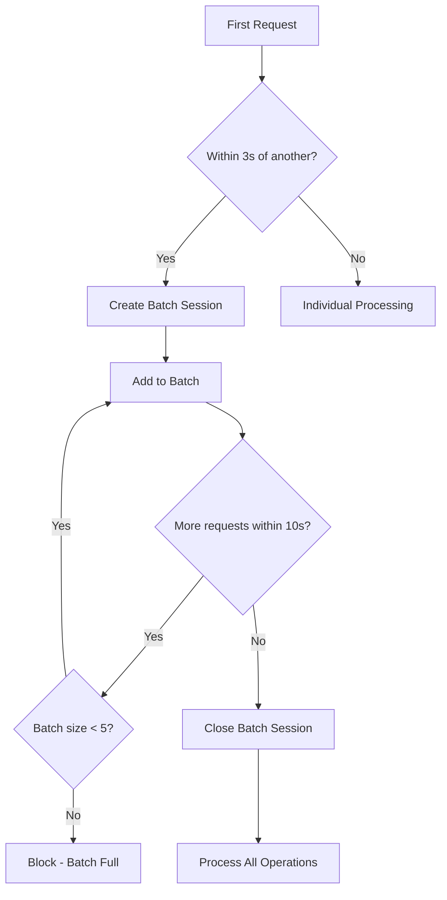

# RoboApply Credit System Documentation

## Table of Contents
1. [System Overview](#system-overview)
2. [Credit Plans & Pricing](#credit-plans--pricing)
3. [Free Usage Limits](#free-usage-limits)
4. [Smart Generation System](#smart-generation-system)
5. [Batch Session Management](#batch-session-management)
6. [Retroactive Refund Logic](#retroactive-refund-logic)
7. [Abuse Prevention](#abuse-prevention)
8. [Rate Limiting](#rate-limiting)
9. [API Endpoints](#api-endpoints)
10. [Database Schema](#database-schema)
11. [Configuration](#configuration)
12. [Error Handling](#error-handling)
13. [Monitoring & Analytics](#monitoring--analytics)

## System Overview

The RoboApply credit system is a comprehensive billing and usage management solution designed for AI-powered resume tailoring features. It provides:

- **Smart credit deduction** with retroactive refunds
- **Batch session optimization** for parallel requests
- **Abuse prevention** with intelligent rate limiting
- **Trial management** for new users
- **Transparent billing** with detailed metadata

### Core Principles

1. **User-First Billing**: Credits are only deducted after successful AI operations
2. **Smart Optimization**: Automatic detection of usage patterns with credit optimization
3. **Abuse Prevention**: Fair usage policies without blocking legitimate users
4. **Transparency**: Detailed breakdown of all credit operations
5. **Race Condition Safety**: Atomic transactions prevent double-charging

## Credit Plans & Pricing

### Free Plan
- **60 credits** for 3 days trial
- **Auto-assigned** to all new users
- **Feature lockout** when trial expires or credits depleted

### Premium Plans
- **Monthly credit allocations** (varies by plan)
- **Rollover credits** available as extra credits
- **No trial limitations**

### Credit Costs by Feature

| Feature | Cost | Free Limit | Notes |
|---------|------|------------|-------|
| Job Description Generation | 2 credits | 3 free per user | After 3rd generation |
| Job Skills Generation | 2 credits | 3 free per user | After 3rd generation |
| Job Title Generation | 2 credits | 3 free per user | After 3rd generation |
| Tailored Resume | 13 credits | No free limit | Retroactive refunds apply |
| Auto Apply | 5 credits | Plan dependent | Feature-gated |
| AI Cover Letter | 3 credits | Plan dependent | Feature-gated |
| Resume Builder | 1 credit | Plan dependent | Feature-gated |
| Resume Score | 1 credit | Plan dependent | Feature-gated |
| Interview Buddy | 2 credits | Plan dependent | Feature-gated |

## Free Usage Limits

```javascript
const FREE_USAGE_LIMITS = {
  JOB_DESCRIPTION_GENERATION: 3,
  JOB_SKILLS_GENERATION: 3,
  JOB_TITLE_GENERATION: 3,
  TAILORED_RESUME: 0, // Always paid
  AUTO_APPLY: 0,
  AI_COVER_LETTER: 0,
  RESUME_BUILDER: 0,
  RESUME_SCORE: 0,
  INTERVIEW_BUDDY: 0
}
```

### Credit Calculation Logic
```javascript
function calculateGenerationCredits(operationType, operationCount, hasTailoredAfterGeneration) {
  const freeLimit = FREE_USAGE_LIMITS[operationType] || 0
  
  if (operationCount <= freeLimit) {
    return 0 // Free
  }
  
  if (hasTailoredAfterGeneration) {
    return 0 // Refunded via retroactive logic
  }
  
  return CREDIT_COSTS[operationType] || 2
}
```

## Smart Generation System

### Individual Generation Flow
```javascript
// 1. Permission Check
const permissionCheck = await creditManager.checkOperationPermissions(userId, operationType)

// 2. Rate Limiting
const rateLimitCheck = await creditManager.checkRateLimitWithParallelDetection(userId, operationType)

// 3. AI Generation
const completion = await openai.chat.completions.create(...)

// 4. Smart Credit Handling
const atomicResult = await creditManager.handleAtomicGeneration(
  userId, operationType, tokensUsed, operationResult
)
```

### Smart Features
- **Atomic Transactions**: Race-condition safe credit deduction
- **Result Validation**: Credits only charged for successful operations
- **Abuse Detection**: Real-time warnings and blocking
- **Parallel Detection**: Automatic batch session creation

## Batch Session Management

### Session Detection
```javascript
// Automatically detects parallel/rapid requests
const BATCH_WINDOW_MS = 10000 // 10 seconds
const PARALLEL_THRESHOLD = 3000 // 3 seconds for parallel detection
const MAX_BATCH_SIZE = 5 // Maximum operations per batch
```

### Session Lifecycle


### Batch Session Schema
```javascript
batchSession: {
  sessionId: "batch_userId_timestamp",
  startTime: Date,
  operations: [{
    type: "JOB_DESCRIPTION_GENERATION",
    timestamp: Date,
    tokensUsed: Number,
    creditsDeducted: Number,
    operationCount: Number,
    result: Object
  }],
  totalCreditsDeducted: Number,
  isActive: Boolean
}
```

### Batch Optimization Features
- **Smart Free Slot Assignment**: Prioritizes expensive operations for free slots
- **Credit Pre-calculation**: Upfront calculation prevents surprises
- **Session Isolation**: Per-user session management
- **Automatic Cleanup**: Sessions auto-expire after 10 seconds

## Retroactive Refund Logic

### Individual Refunds
```javascript
// Refunds last 5 non-free generations per type when tailoring
const calculateRetroactiveRefund = (userId) => {
  const refundableGenerations = Math.min(
    generationsWithoutTailoring,
    5 // Maximum refundable generations
  )
  return refundableGenerations * 2 // 2 credits per generation
}
```

### Batch Refunds
```javascript
// Enhanced tailoring with batch detection
const deductCreditsForTailoringWithBatchRefund = async (userId, tokensUsed) => {
  let batchRefund = 0
  let individualRefund = 0

  // Check for recent batch session (within 5 minutes)
  if (userSub.batchSession && batchAge <= 300000) {
    batchRefund = userSub.batchSession.totalCreditsDeducted
    userSub.batchSession = {} // Clear after refund
  }

  // Calculate individual refunds for non-batch operations
  const individualRefundResult = await calculateRetroactiveRefund(userId)
  individualRefund = individualRefundResult.refundAmount

  const totalRefund = batchRefund + individualRefund
  const finalCost = Math.max(0, TAILORING_COST - totalRefund)
}
```

### Refund Windows
- **Batch Refunds**: 5 minutes from batch session start
- **Individual Refunds**: No time limit, based on `generationsWithoutTailoring` counter
- **Combined Logic**: Both types can apply simultaneously

## Abuse Prevention

### Detection Mechanisms
```javascript
// Real-time abuse detection
const shouldWarnAbuse = (generationsWithoutTailoring, totalGenerations) => {
  if (generationsWithoutTailoring >= 5) {
    return {
      shouldBlock: true,
      message: "Too many generations without tailoring. Please create a tailored resume first.",
      severity: "BLOCKING"
    }
  }
  
  if (generationsWithoutTailoring >= 3) {
    return {
      shouldWarn: true,
      message: `You've generated ${generationsWithoutTailoring} items. Consider running a tailored resume to optimize your credits.`,
      severity: "WARNING"
    }
  }
}
```

### Abuse Thresholds
- **Warning at 3**: Soft warning to encourage tailoring
- **Block at 5**: Hard block until tailoring is performed
- **Reset on Tailoring**: Counter resets to 0 after successful tailoring

### Counter Management
```javascript
// Incremented on each generation
userSub.usage.generationsWithoutTailoring += 1

// Reset on tailoring
userSub.usage.generationsWithoutTailoring = 0
```

## Rate Limiting

### Multi-Level Rate Limiting
```javascript
// Per-operation limits
const RATE_LIMITS = {
  perMinute: 5,    // 5 requests per minute per operation
  per5Minutes: 15, // 15 requests per 5 minutes per operation
  parallelMax: 5   // Max 5 parallel requests across all operations
}
```

### Parallel Abuse Detection
```javascript
// Cross-endpoint parallel detection
const checkParallelAbuse = (userId) => {
  const generationTypes = ['JOB_DESCRIPTION_GENERATION', 'JOB_SKILLS_GENERATION', 'JOB_TITLE_GENERATION']
  
  let totalParallelRequests = 0
  for (const genType of generationTypes) {
    const recentRequests = rateLimiting[genType].requests.filter(
      requestTime => (now - new Date(requestTime)) < 3000
    )
    totalParallelRequests += recentRequests.length
  }
  
  return totalParallelRequests >= 5 // Block if 5+ parallel
}
```

### Rate Limit Response
```javascript
// 429 response with retry information
{
  "msg": "Rate limit exceeded. Please wait 60 seconds and try again.",
  "success": false,
  "error": "RATE_LIMITED",
  "data": {
    "requestsLastMinute": 6,
    "requestsLast5Minutes": 12,
    "maxPerMinute": 5,
    "maxPer5Minutes": 15,
    "retryAfter": 60
  }
}
```

## API Endpoints

### Generation Endpoints
```
POST /api/ai-resume-tailor/generate-job-description
POST /api/ai-resume-tailor/generate-job-skills  
POST /api/ai-resume-tailor/generate-job-title
POST /api/ai-resume-tailor/get-tailored-data-for-resume
```

### Utility Endpoints
```
GET /api/ai-resume-tailor/credit-status
```

### Standard Response Format
```javascript
// Success Response
{
  "msg": "Operation completed successfully",
  "success": true,
  "data": {
    "result": { /* operation-specific data */ },
    "metadata": {
      "generated_at": "2025-01-20T10:30:00Z",
      "tokens_used": 1250,
      "credits_used": 2,
      "remaining_credits": 45,
      "operation_count": 4,
      "batch_info": { /* batch session info if applicable */ },
      "warning": "Optional warning message"
    }
  }
}

// Error Response  
{
  "msg": "Descriptive error message",
  "success": false,
  "error": "ERROR_CODE",
  "data": { /* error-specific details */ }
}
```

### Credit Status Response
```javascript
{
  "msg": "Credit status retrieved successfully",
  "success": true,
  "data": {
    "planName": "Free Plan",
    "planIdentifier": "free_plan",
    "monthlyCreditsLimit": 60,
    "monthlyCreditsUsed": 15,
    "extraCredits": 0,
    "totalCreditsAvailable": 45,
    "usage": {
      "jobDescriptionGenerations": 2,
      "jobSkillsGenerations": 1,
      "jobTitleGenerations": 1,
      "tailoredResumesUsed": 0,
      "generationsWithoutTailoring": 4
    },
    "trialStatus": {
      "isTrialActive": true,
      "daysRemaining": 2,
      "shouldLockFeatures": false
    },
    "freeUsageLimits": {
      "JOB_DESCRIPTION_GENERATION": 3,
      "JOB_SKILLS_GENERATION": 3,
      "JOB_TITLE_GENERATION": 3
    }
  }
}
```

## Database Schema

### User Model Extensions
```javascript
// User.model.js additions
{
  credits: { type: Number, default: 0 },           // Extra credits
  isFreePlanExpired: { type: Boolean, default: false }
}
```

### UserSubscription Model
```javascript
{
  userId: ObjectId,
  subscriptionPlanId: ObjectId,
  
  planSnapshot: {
    name: String,
    identifier: String,
    monthlyCredits: Number,
    // ... other plan details
  },
  
  usage: {
    monthlyCreditsUsed: { type: Number, default: 0 },
    
    // Operation counters
    jobDescriptionGenerations: { type: Number, default: 0 },
    jobSkillsGenerations: { type: Number, default: 0 },
    jobTitleGenerations: { type: Number, default: 0 },
    tailoredResumesUsed: { type: Number, default: 0 },
    
    // Abuse tracking
    generationsWithoutTailoring: { type: Number, default: 0 },
    
    // Rate limiting metadata
    rateLimiting: {
      [operationType]: {
        requests: [Date],
        lastRequestTime: Date,
        parallelRequests: Number
      }
    }
  },
  
  // Batch session tracking
  batchSession: {
    sessionId: String,
    startTime: Date,
    operations: [{
      type: String,
      timestamp: Date,
      tokensUsed: Number,
      creditsDeducted: Number,
      operationCount: Number,
      result: Mixed
    }],
    totalCreditsDeducted: Number,
    isActive: Boolean
  },
  
  startDate: Date,
  endDate: Date,
  isActive: Boolean
}
```

## Configuration

### Credit Configuration (`config/ai/credits.config.js`)
```javascript
const CREDIT_COSTS = {
  JOB_DESCRIPTION_GENERATION: 2,
  JOB_SKILLS_GENERATION: 2,
  JOB_TITLE_GENERATION: 2,
  TAILORED_RESUME: 13,
  AUTO_APPLY: 5,
  AI_COVER_LETTER: 3,
  RESUME_BUILDER: 1,
  RESUME_SCORE: 1,
  INTERVIEW_BUDDY: 2
}

const FREE_USAGE_LIMITS = {
  JOB_DESCRIPTION_GENERATION: 3,
  JOB_SKILLS_GENERATION: 3,
  JOB_TITLE_GENERATION: 3
  // Others default to 0
}

const GATING_LOGIC = {
  TRIAL_EXPIRED_MESSAGE: "Your free trial has expired. Please upgrade to continue using AI features.",
  INSUFFICIENT_CREDITS_MESSAGE: "Insufficient credits to perform this operation. Please purchase more credits or upgrade your plan.",
  ABUSE_WARNING_MESSAGE: "You've generated multiple items without creating a tailored resume. Please create a tailored resume to optimize your credit usage.",
  GENERATION_ABUSE_THRESHOLD: 5
}
```

### Trial Configuration
```javascript
const TRIAL_CONFIG = {
  DURATION_DAYS: 3,
  INITIAL_CREDITS: 60
}
```

## Error Handling

### Error Types
```javascript
const ERROR_TYPES = {
  // Credit-related
  INSUFFICIENT_CREDITS: "INSUFFICIENT_CREDITS",
  TRIAL_EXPIRED: "TRIAL_EXPIRED",
  
  // Abuse-related
  ABUSE_DETECTED: "ABUSE_DETECTED",
  RATE_LIMITED: "RATE_LIMITED",
  PARALLEL_ABUSE: "PARALLEL_ABUSE",
  
  // Batch-related
  BATCH_SIZE_EXCEEDED: "BATCH_SIZE_EXCEEDED",
  BATCH_TIMEOUT: "BATCH_TIMEOUT",
  
  // System errors
  API_FAILURE: "API_FAILURE",
  VALIDATION_FAILED: "VALIDATION_FAILED",
  ATOMIC_OPERATION_FAILED: "ATOMIC_OPERATION_FAILED"
}
```

### Error Response Examples
```javascript
// Insufficient Credits
{
  "msg": "Insufficient credits to perform this operation.",
  "success": false,
  "error": "INSUFFICIENT_CREDITS",
  "data": {
    "creditsNeeded": 2,
    "creditsAvailable": 0,
    "suggestedAction": "UPGRADE_PLAN"
  }
}

// Rate Limited
{
  "msg": "Too many simultaneous requests detected.",
  "success": false,
  "error": "PARALLEL_ABUSE",
  "data": {
    "parallelRequests": 6,
    "maxParallel": 5,
    "retryAfter": 10
  }
}

// Abuse Detected
{
  "msg": "Too many generations without tailoring. Please create a tailored resume first.",
  "success": false,
  "error": "ABUSE_DETECTED",
  "data": {
    "generationsWithoutTailoring": 5,
    "suggestedAction": "TAILOR_RESUME"
  }
}
```

### Failure Logging
```javascript
// Failed operations are logged but no credits charged
await creditManager.logFailedOperation(
  userId, 
  operationType, 
  errorType,
  { 
    errorMessage: error.message,
    statusCode: error.status,
    tokensUsed: completion.usage?.total_tokens || 0
  }
)
```

## Monitoring & Analytics

### Usage Tracking
- **Operation counts** per user per type
- **Credit consumption** patterns
- **Batch session** creation and completion rates
- **Abuse detection** triggers and resolutions
- **API failure** rates and types

### Key Metrics
```javascript
// Per-user metrics
{
  totalCreditsUsed: Number,
  averageCreditsPerSession: Number,
  batchSessionsCreated: Number,
  retroactiveRefundsReceived: Number,
  abuseWarningsTriggered: Number,
  rateLimitHits: Number
}

// System-wide metrics
{
  totalActiveUsers: Number,
  averageCreditsPerUser: Number,
  batchOptimizationSavings: Number,
  abuseDetectionAccuracy: Number,
  apiSuccessRate: Number
}
```

### Real-time Monitoring
- **Credit deduction** success/failure rates
- **Batch session** optimization effectiveness
- **Rate limiting** impact on user experience
- **Trial conversion** rates
- **Retroactive refund** utilization

## Implementation Examples

### Basic Generation Flow
```javascript
// Controller implementation
async generateJobDescription(req, res) {
  try {
    const { company_url, job_title } = req.body
    const userId = req.token._id

    // 1. Rate limiting check
    const rateLimitCheck = await creditManager.checkRateLimitWithParallelDetection(
      userId, 'JOB_DESCRIPTION_GENERATION'
    )
    if (!rateLimitCheck.allowed) {
      return res.status(429).json({
        msg: rateLimitCheck.message,
        success: false,
        error: rateLimitCheck.reason,
        data: rateLimitCheck.data
      })
    }

    // 2. Permission check
    const permissionCheck = await creditManager.checkOperationPermissions(
      userId, 'JOB_DESCRIPTION_GENERATION'
    )
    if (!permissionCheck.allowed) {
      return res.status(402).json({
        msg: permissionCheck.message,
        success: false,
        error: permissionCheck.reason,
        data: permissionCheck.data
      })
    }

    // 3. AI generation
    const completion = await openai.chat.completions.create({
      model: "gpt-4o-mini",
      messages: [
        { role: "system", content: systemPrompt },
        { role: "user", content: userPrompt }
      ],
      max_tokens: 600,
      temperature: 0.7
    })

    const generatedDescription = completion.choices[0]?.message?.content?.trim()
    if (!generatedDescription) {
      await creditManager.logFailedOperation(
        userId, 'JOB_DESCRIPTION_GENERATION', 'EMPTY_RESPONSE',
        { tokensUsed: completion.usage?.total_tokens || 0 }
      )
      throw new Error("No job description generated")
    }

    // 4. Smart credit handling with batch optimization
    const atomicResult = await creditManager.handleAtomicGeneration(
      userId,
      'JOB_DESCRIPTION_GENERATION',
      completion.usage?.total_tokens || 0,
      { job_description: generatedDescription }
    )

    if (atomicResult.blocked) {
      return res.status(atomicResult.reason === 'ABUSE_DETECTED' ? 429 : 402).json({
        msg: atomicResult.message,
        success: false,
        error: atomicResult.reason,
        data: atomicResult.data
      })
    }

    // 5. Success response
    return res.status(200).json({
      msg: "Job description generated successfully",
      success: true,
      data: {
        job_description: generatedDescription,
        metadata: {
          generated_at: new Date().toISOString(),
          tokens_used: completion.usage?.total_tokens || 0,
          credits_used: atomicResult.creditsDeducted,
          remaining_credits: atomicResult.remainingCredits,
          operation_count: atomicResult.operationCount,
          batch_info: atomicResult.batchInfo || null,
          warning: atomicResult.warning
        }
      }
    })

  } catch (error) {
    // Error handling with proper logging
    await creditManager.logFailedOperation(
      req.token._id, 'JOB_DESCRIPTION_GENERATION', 
      error.status === 429 ? 'RATE_LIMIT' : 'API_ERROR',
      { errorMessage: error.message }
    )

    return res.status(500).json({
      msg: "Failed to generate job description",
      success: false,
      error: error.message
    })
  }
}
```

### Batch Session Example
```javascript
// User makes 3 simultaneous requests
// t=0s: /generate-job-description
// t=1s: /generate-job-skills  
// t=2s: /generate-job-title

// Batch session created automatically:
{
  sessionId: "batch_user123_1642678900000",
  startTime: "2025-01-20T10:00:00Z",
  operations: [
    {
      type: "JOB_DESCRIPTION_GENERATION",
      timestamp: "2025-01-20T10:00:00Z",
      creditsDeducted: 0, // Free slot #1
      operationCount: 1
    },
    {
      type: "JOB_SKILLS_GENERATION", 
      timestamp: "2025-01-20T10:00:01Z",
      creditsDeducted: 0, // Free slot #1
      operationCount: 1
    },
    {
      type: "JOB_TITLE_GENERATION",
      timestamp: "2025-01-20T10:00:02Z", 
      creditsDeducted: 0, // Free slot #1
      operationCount: 1
    }
  ],
  totalCreditsDeducted: 0,
  isActive: false // Auto-closed after batch window
}

// User runs tailoring within 5 minutes:
// Batch refund: 0 credits (all were free)
// Final tailoring cost: 13 credits
```

### Retroactive Refund Example
```javascript
// User generates 4 job descriptions individually
// Credits charged: 0, 0, 0, 2 (first 3 free, 4th costs 2)

// User then tailors resume:
const tailoringResult = await creditManager.deductCreditsForTailoringWithBatchRefund(
  userId, tokensUsed
)

// Result:
{
  success: true,
  creditsDeducted: 13,      // Tailoring cost
  refundsApplied: 2,        // Refund for 4th generation
  metadata: {
    tailoringCost: 13,
    batchRefund: 0,         // No active batch session
    individualRefund: 2,    // 1 generation × 2 credits
    finalCost: 11,          // 13 - 2 = 11
    individualGenerationsRefunded: 1
  },
  message: "Tailored resume generated with 2 credits refunded from recent generations"
}
```

## Best Practices

### For Developers
1. **Always use atomic operations** for credit handling
2. **Validate AI responses** before charging credits
3. **Log failed operations** for analytics and debugging
4. **Handle race conditions** with proper transactions
5. **Test batch scenarios** thoroughly

### For System Administration
1. **Monitor abuse patterns** and adjust thresholds as needed
2. **Track batch optimization** effectiveness
3. **Review rate limiting** impact on user experience
4. **Analyze retroactive refund** usage patterns
5. **Monitor API failure** rates and causes

### For Support Teams
1. **Credit status endpoint** provides comprehensive user information
2. **Batch session data** helps explain credit charges
3. **Abuse counters** indicate when users need guidance
4. **Rate limit data** explains temporary blocks
5. **Refund metadata** shows optimization in action

This documentation provides a complete reference for understanding, implementing, and maintaining the RoboApply credit system with batch session management.
